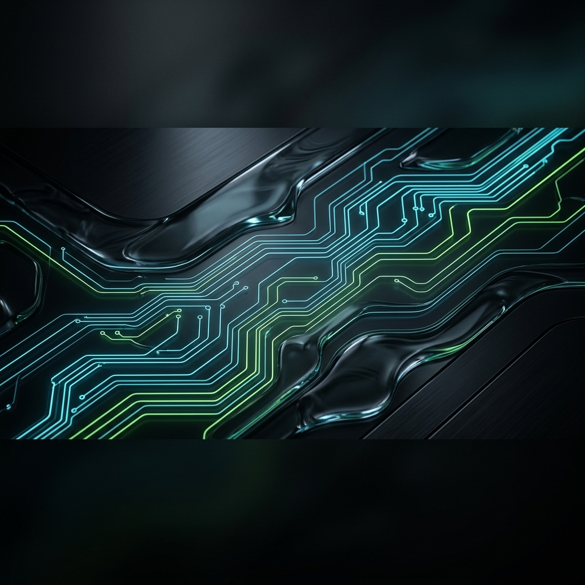

<p align="center">
  
</p>

<p align="center">
  
  
  
</p>

## ⚡ NIM-Agent
**The surgical fork of Claude Code, hardcoded for NVIDIA NIM.**

### 🚀 Quick Install
```bash
curl -sSL https://raw.githubusercontent.com/reachvaibab-gif/nim-agent/main/setup-nim.sh | bash
```

### 🛰️ Neural Setup
1. **Get Key**: Visit [build.nvidia.com](https://build.nvidia.com) (Free 1,000 credits).
2. **Select**: Qwen 3 Coder 480B (Coding) or Llama 3.1 405B (Agentic).
3. **Launch**: Run `openclaude` and paste your `nvapi-` key.

---
*Architected by reachvaibab-gif.*
